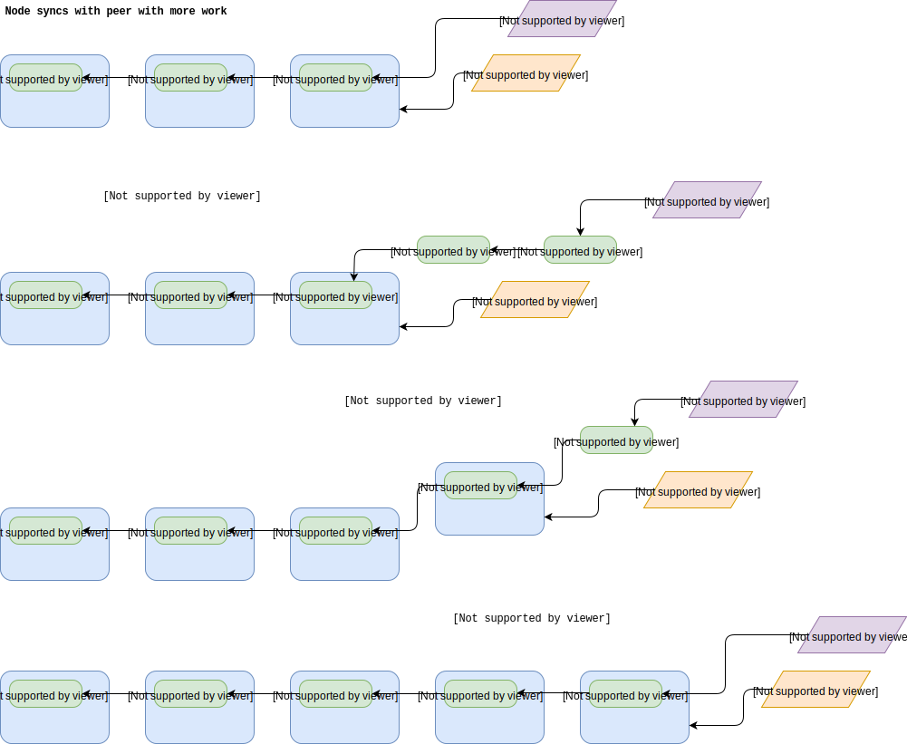

# Blocks and Block headers

## Node receives block from peer (normal operation)

During normal operation the Grin node will receive blocks from connected peers via the gossip protocol.
If the block and the block header validate successfully then both are saved to the store. The header head is updated to point to the latest block header and the block head is updated to point to the latest block.

## Node syncs for first time

[tbd]

## Node falls behind (sync to catch up with peer)

Periodically the node will compare its current `total_difficulty` to the `total_difficulty` of all connected peers. If a peer with higher total_difficulty is seen then we attempt to sync to this peer (most_work_peer). If multiple most_work_peers exist then one is selected at random.
The sync process is initiated by building a "locator" based on current known chain state (see [tbd] for more info on the locator) and requesting a list of headers from the peer, passing the locator to help select appropriate headers.
On receiving the list of headers the node will validate them and then save them to the store. For each header the header head will be updated to reflect the most recent header.
The node will then request each "missing" block by comparing the header chain (back from the header head) to the current block chain (back from the block head). Blocks are requested from peers with larger total_difficulty than the node. This process is repeated until no peers are seen with higher total_difficulty and both heads are in a consistent state (pointing to the same head/block).

## Node successfully mines a block

[tbd]

## Two competing blocks are mined (temporary fork)

[tbd]

## A new peer connects with a previously unknown longest fork

[tbd]
