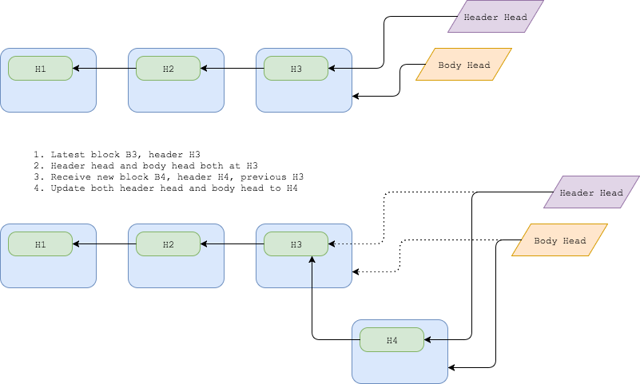
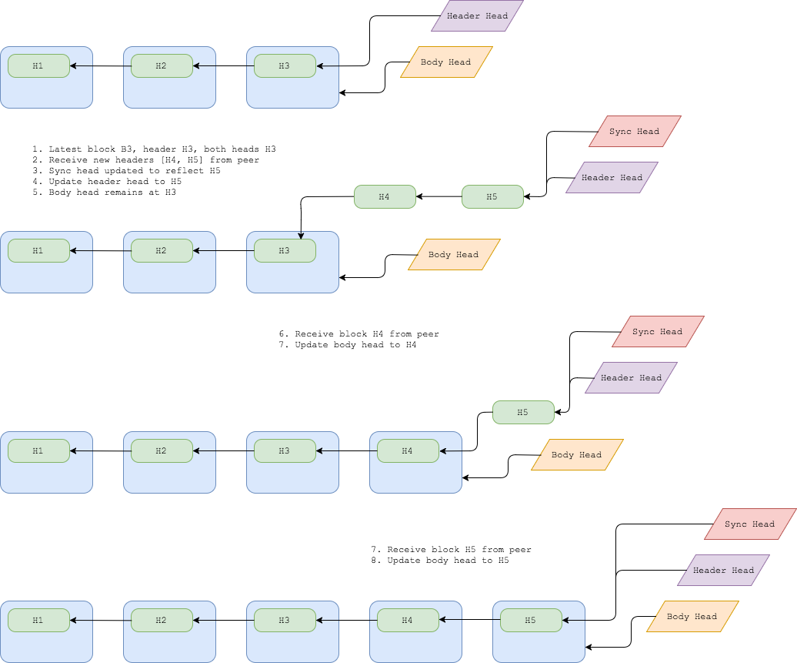
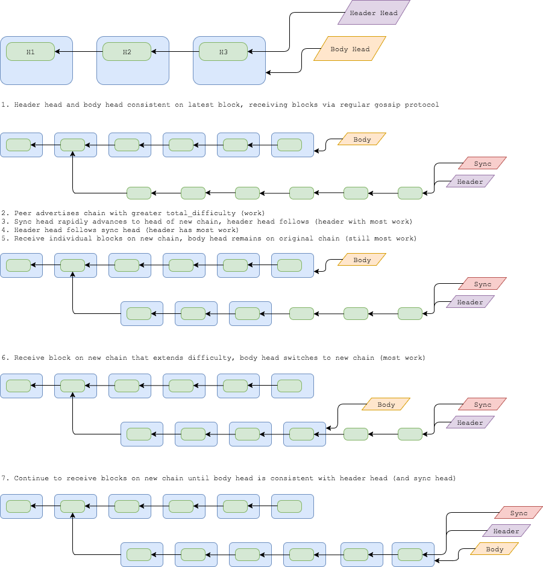

# Blocks and Block headers

## 정상 운영시 노드가 피어로부터 블록을 받는것에 대해서

정상 동작 중에 Grin 노드는 가십 프로토콜을 통해 연결된 피어로부터 블록을 받습니다.
블록과 블록 헤더의 유효성이 성공적으로 확인되면 둘 다 저장됩니다. 헤더 헤드가 최신 블록 헤더를 가리키도록 업데이트되고 블록 헤드가 최신 블록을 가리키도록 업데이트됩니다.

## 노드가 처음 동기화 될때

[tbd]

## 노드가 블록의 상태를 따라잡기 위해 피어와 동기화 하는것에 대해서

노드는 주기적으로 현재의`total_difficulty`와 연결된 모든 피어들의 `total_difficulty`를 비교할 것입니다. total_difficulty가 더 높은 피어가 표시되면이 가장 많이 일한 피어(most_work_peer)와 동기화를 시도합니다. most_work_peers가 여러 개 있으면 그 중 하나가 무작위로 선택됩니다.
동기화 프로세스는 현재 알려진 체인 상태 (locator에 대한 자세한 정보는 [tbd] 참고하세요.)를 기반으로 "locator"를 빌드하고 그 다음 피어에게서 헤더 목록을 요청하고 해당 헤더를 선택하는 데 도움이되는 locator를 전달하면서 시작됩니다.
헤더 목록을 수신하면 노드는 노드의 유효성을 확인한 다음 저장합니다. 각 헤더에 대해 가장 최근 헤더를 반영하도록 헤더 헤드가 업데이트 됩니다.
그러면 노드는 헤더체인 (헤더 헤드에서 부터 역순으로)과 현재 블록체인 (블록 헤드에서부터 역순으로)을 비교하여 각 "누락한" 블록을 요청합니다. 블록은 노드보다 total_difficulty가 큰 피어에게 요청됩니다. 이 프로세스는 (노드보다) 더 높은 total_difficulty를 가진 피어가 보이지 않고 두 헤드(헤더헤드 & 블록헤드) 가 일치한 상태 (동일한 헤드 / 블록을 가리키고 있음)에 있을 때까지 반복됩니다.

## 새로운 피어가 이전에 알려지지 않은 가장 긴 fork 와 연결된 경우

## 노드가 매우 뒤떨어져 있을때에 대해서 ( 500 블록 이상 )

현재 헤더 검색은 약 500 헤더 (512?)의 배치로 제한됩니다.  500개 헤더의  첫 배치를 받은 이후에 새로운 헤더 체인이 되지만 새로운 체인의  total_difficulty가 기존 체인을 추월하기에 충분하지 않을 때 어떤 일이 발생하는지 정확히 설명해야합니다.
여기서 어떻게될까요?

## 노드가 블록을 성공적으로 마이닝 했을때에 대해서

[tbd]

## 두 블록이 같이 채굴 되었을때 ( 일시적인 포크)에 대해서

[tbd]
