Dandelion Simulation
==================
This document describes a network of node with Dandelion.

In this scenario, we simulate a successfull aggregation but a failed transaction cut-through forcing a node to revert its stempool state.

This document also helps visualizing all the timers in a simple way.

## Initial Situation

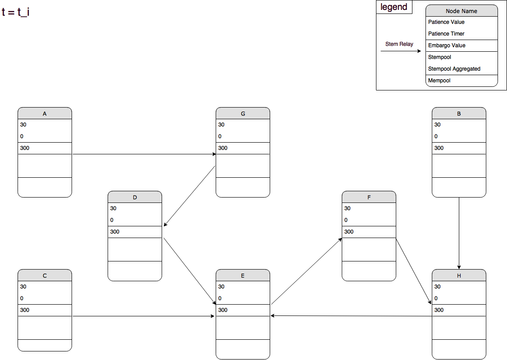

## T = 0

A sends grins to B. B adds the transaction to its stempool and starts its patience timer.

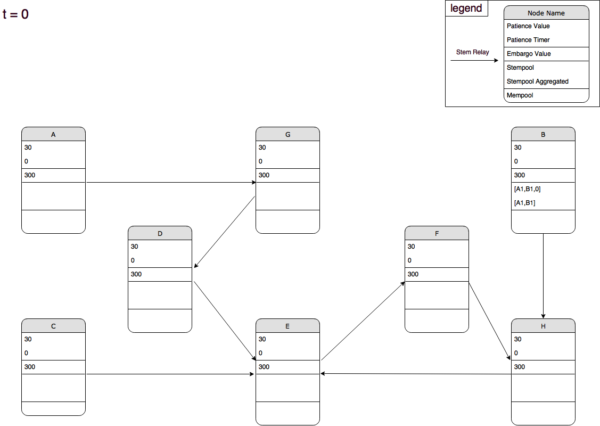

## T = 10

B waits until he runs out of patience.

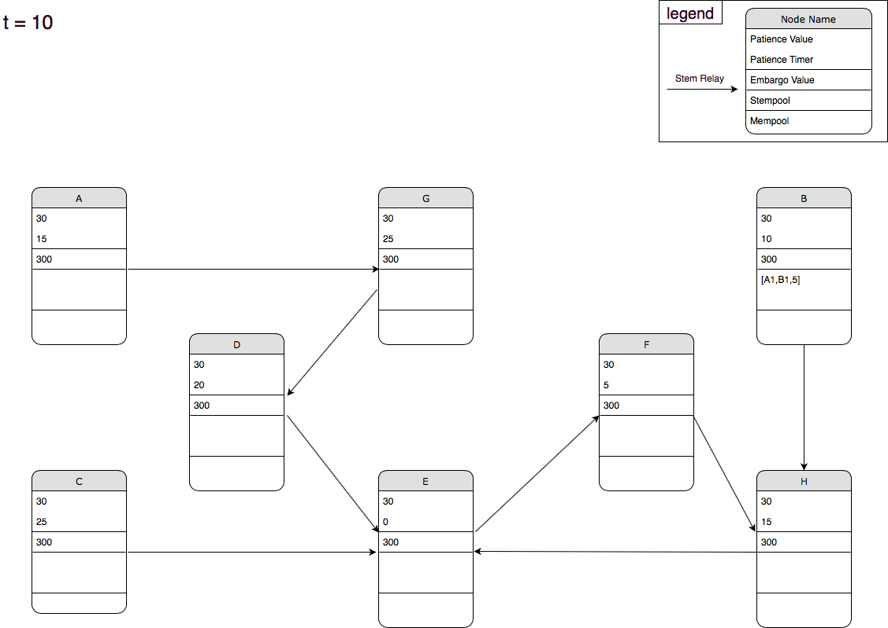

## T = 30

B runs out of patience, flips a coin, broadcasts the transaction to its stem relay and starts the embargo timer for this transaction.

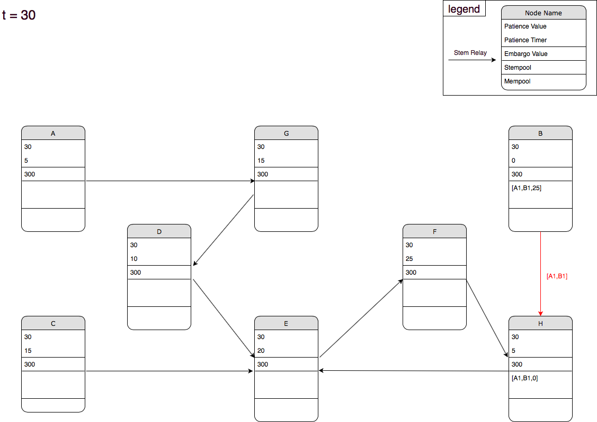

## T = 35

B and H wait.

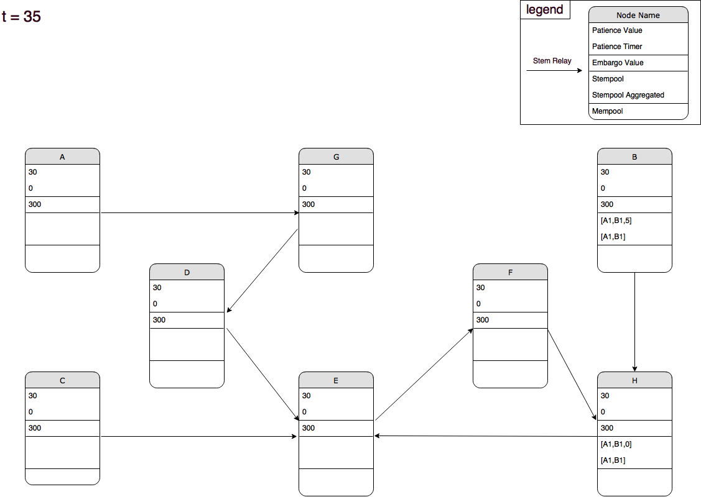

## T = 40

G sends grins to E.
E adds the transaction to its stempool and starts its patience timer.

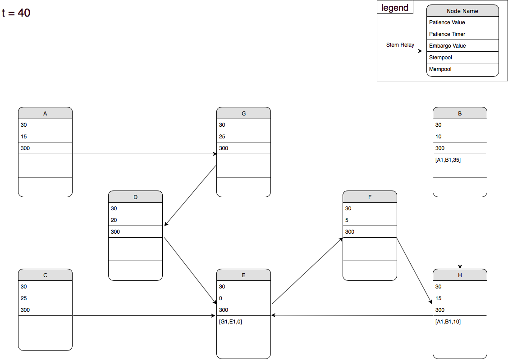

## T = 50

B, H and E wait.

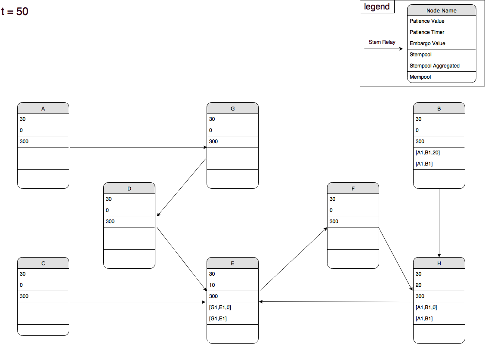

## T = 55

B spends B1 to D.
D adds the transaction to its stempool and starts its patience timer.

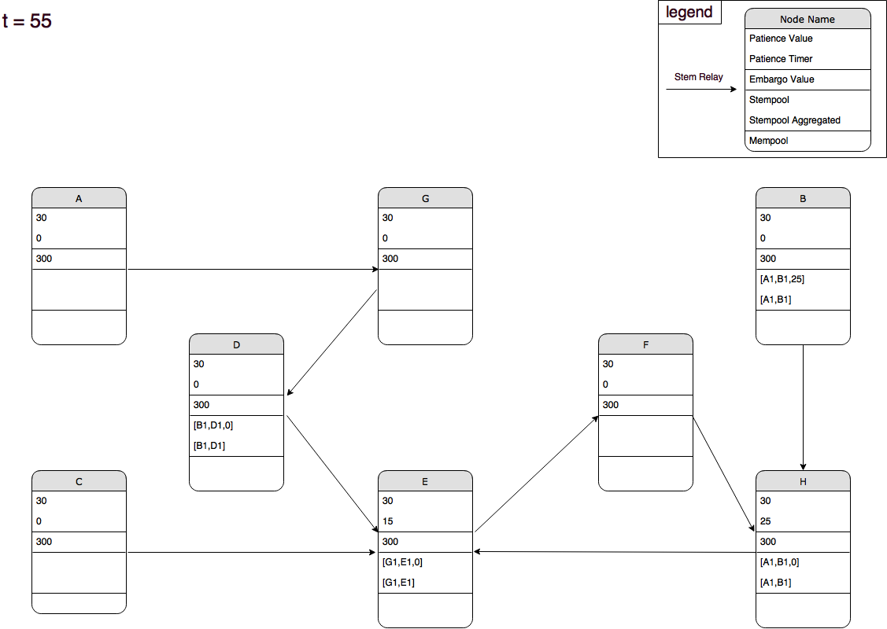

## T = 60

H runs out of patience, flips a coin, broadcasts the transaction to its stem relay and starts the embargo timer for this transaction.

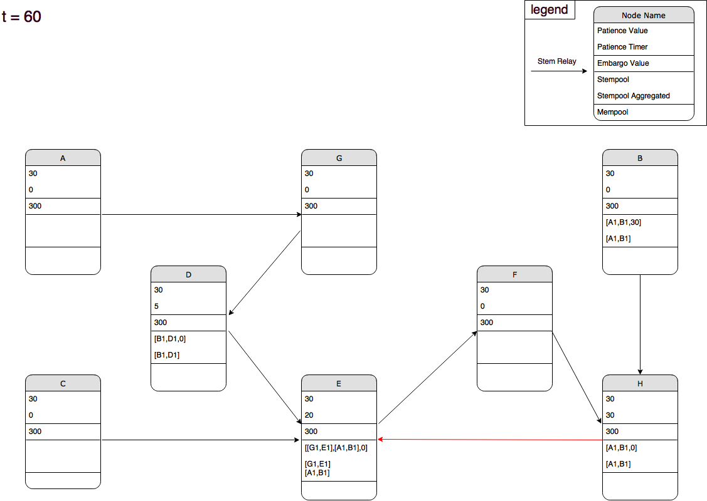

## T = 65

Waiting.

## T = 70

E runs out of patience, flips a coin, broadcasts the aggregated transaction to its stem relay and starts the embargo timer for this transaction.

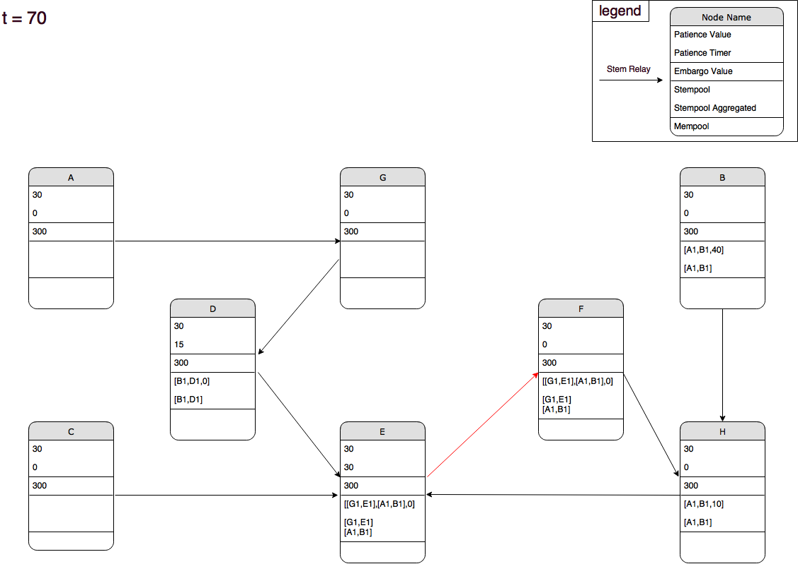

## T = 75

Waiting.

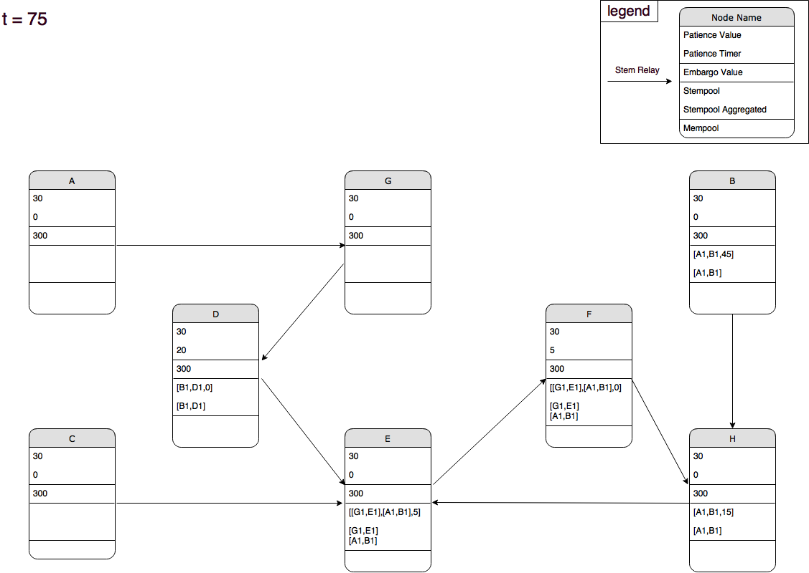

## T = 85

D runs out of patience, flips a coin, broadcasts the aggregated transaction to its stem relay and starts the embargo timer for this transaction.
E receives the stem transaction, aggregates them (thus removing duplicate input/output pair B1) and starts its patience timer.

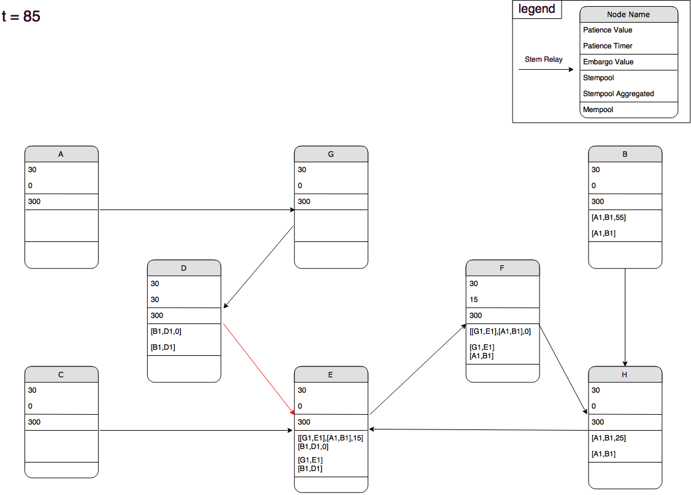

## T = 100

F runs out of patience, flips a coin, broadcasts the aggregated transaction to all its peers (fluff in the mempool).
E receives the transaction in its mempool and reverts the state of its stempool to avoid conflicting transactions.

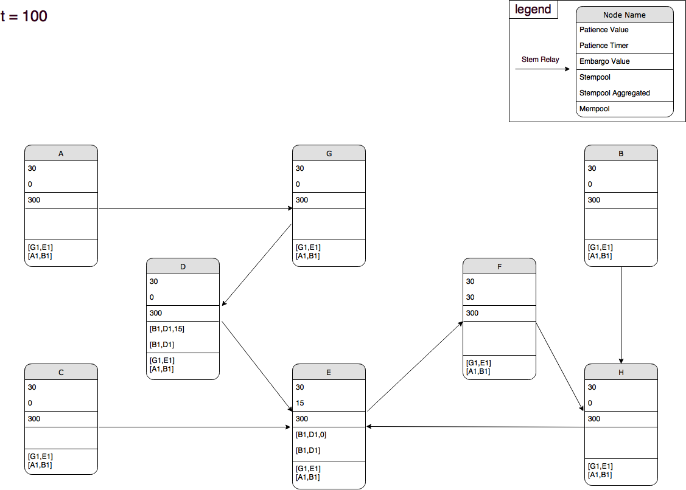
