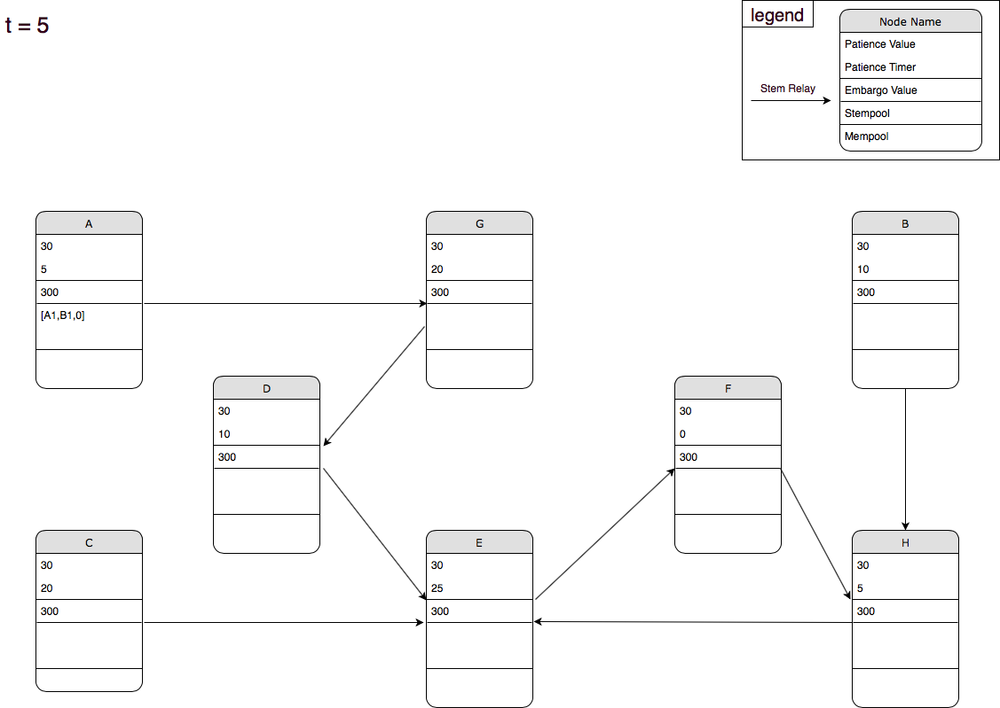
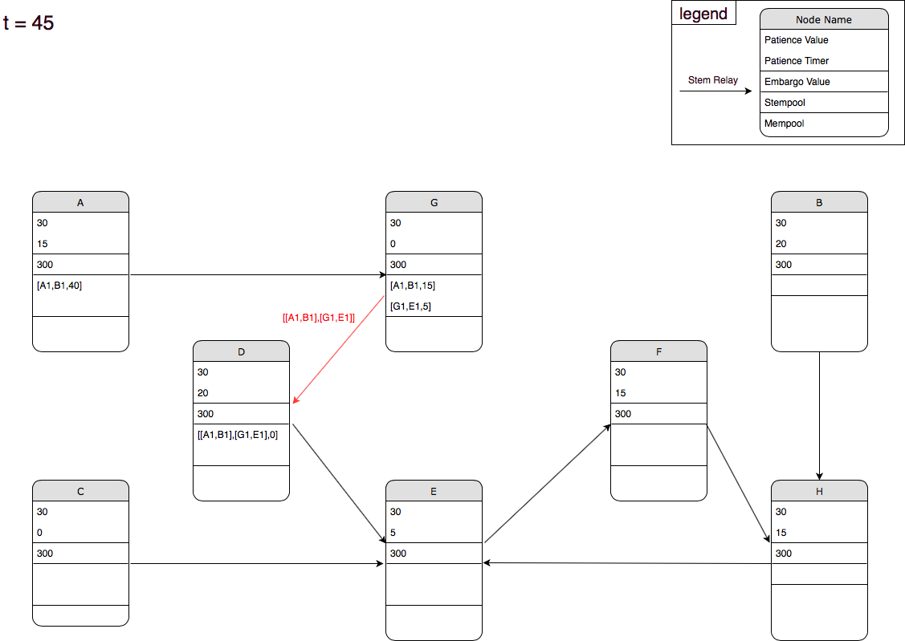
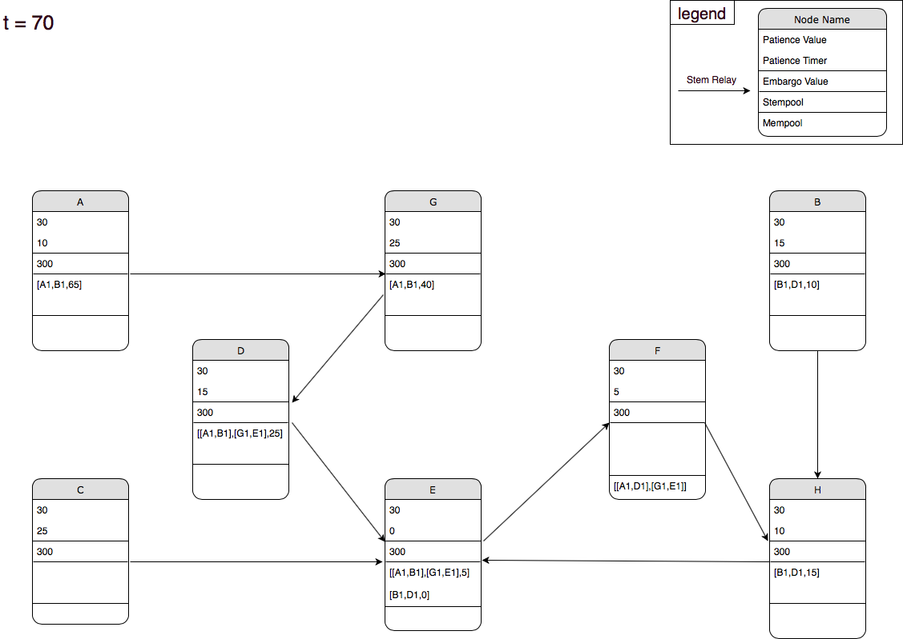
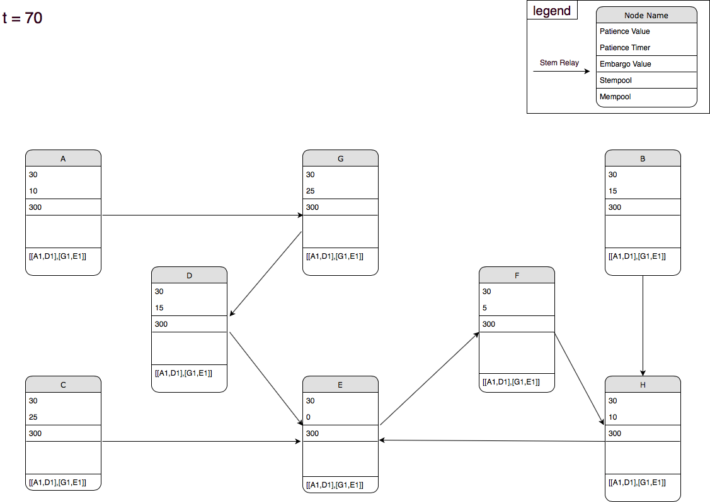

Dandelion Simulation
==================
This document describes a network of node using the Dandelion protocol with transaction aggregation.

In this scenario, we simulate a successful aggregation.

This document also helps visualizing all the timers in a simple way.

## T = 0 - Initial Situation

## T = 5

A sends grins to B. A adds the transaction to its stempool and starts the embargo timer for this transaction.

## T = 10

A waits until he runs out of patience.

## T = 30

A runs out of patience, flips a coin and broadcasts the stem transaction to its Dandelion relay G.
G receives the stem transaction, add it to its stempool and starts the embargo timer for this transaction.
 

## T = 40

G sends grins to E.
G adds the transaction it to its stempool and starts the embargo timer for this transaction.

## T = 45

G runs out of patience, flips a coin and broadcasts the stem transaction to its Dandelion relay D.

## T = 50

B spends B1 to D.
B add it to its stempool and starts the embargo timer for this transaction.

## T = 55

B runs out of patience, flips a coin and broadcasts the stem transaction to its Dandelion relay H.
D runs out of patience, flips a coin and broadcasts the aggregated stem transaction to its Dandelion relay E.
E receives the stem transaction, add it to its stempool and starts the embargo timer for this transaction.

## T = 60

H runs out of patience, flips a coin broadcasts the stem transaction to its Dandelion relay E.
E receives the stem transaction, add it to its stempool and starts the embargo timer for this transaction.

## T = 70 - Step 1

E runs out of patience, flips a coin and decide to broadcast the transaction to all its peers (fluff in the mempool).

## T = 70 - Step 2

All the nodes add this transaction to their mempool and remove the related transactions from their stempool.

