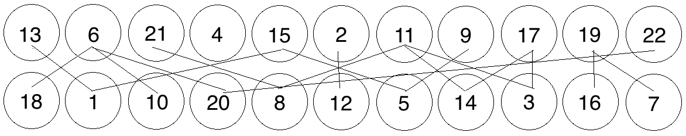

Grin's Proof-of-Work
====================

[[WIP]]

#Cuckoo Cycles

Grin's basic Proof-of-Work algorithm is called Cuckoo Cycle, which is specifically designed
to be resistant to Bitcoin style hardware arms-races. It is primarily a memory bound algorithm,
which, (at least in theory,) means that solution time is limited to the speed of a system's RAM
rather than processor or GPU speed. As such, mining Cuckoo Cycle solutions should be viable on
most commodity hardware, and require far less energy than most other GPU, CPU or ASIC-bound 
proof of work algorithms.

The Cuckoo Cycle POW is the work of John Tromp, and the most up-to-date documentation and implementations
can be found in [his github repository](https://github.com/tromp/cuckoo). The
[white paper](https://github.com/tromp/cuckoo/blob/master/doc/cuckoo.pdf) is the best source of
further technical details. 

##Cuckoo Cycle Primer 

While this document is meant to outline Grin's POW system, a very high-level understanding of the
Cuckoo Cycle POW is desirable before moving on to the Grin-specific details. In order to keep this
 document accessible, a brief overview of the Cuckoo Cycle POW is given below. 

####Cycles in a Graph

Cuckoo Cycles is an algoritm meant to detect cycles in a random bipartite graphs graph of N nodes and M edges.
In plainer terms, a Node is simply an element storing a value, an Edge is a line connecting two nodes,
and a graph is bipartite when it's split into two groupings. The simple
graph below, with values placed at random, denotes just such a graph, with 8 Nodes storing 8 values 
divided into 2 groups (one row on top and one row on the bottom,) and zero Edges (i.e. no lines
connecting any nodes.) 

*A graph of 8 Nodes with Zero Edges*

Let's throw a few Edges into the graph now, randomly:

*8 Nodes with 4 Edges*

We now have a randomly-generated graph with 8 nodes (N) and 4 edges (M), or an NxM graph where 
N=8 and M=4. Our basic Proof-of-Work is now concerned with finding 'cycles' of a certain length 
within this random graph, or, put simply, a path of connected nodes. So, if we were looking
for a cycle of length 3 (a path connecting 3 nodes), one can be detected in this graph, 
i.e. the path running from 5 to 6 to 3:

*Cycle found*

Adjusting the number of Edges M relative to the number of Nodes N changes the difficulty of the 
cycle-finding problem, and the probability that a cycle exists in the current graph. For instance,
if our POW problem were to find a cycle of length 5 in the graph, the current difficulty of 5/8 (M/N)
would mean that all 5 edges would need to be randomly generated in a perfect cycle in order for
there to be a solution. If you increase the number of edges relative to the number of nodes,
you increase the probability that a solution exists:

*MxN = 9x8 Cycle of length 5 found*

So modifying the ratio M/N changes the number of expected occurrences of a cycle within a randomly
generated graph. 

For a small graph such as the one above, determining whether a cycle of a certain length exists is trivial. 
But as the graphs get larger, detecting such cycles becomes more difficult. For instance, does this
 graph have a cycle of length 7, i.e. 7 directly connected nodes?

*Meat-space Cycle Detection exercise*

The answer is left as an exercise to the reader, but the point is that detecting such cycles becomes
a more difficult exercise as the size of a graph grows.

###Cuckoo Cycles

The Cuckoo Cycles algorithm is a specialised algorithm designed to solve exactly this problem, and it does
so by inserting values into a structure called a 'Cuckoo Hashtable' according to a hash which maps nodes
into possible locations in two separate arrays. This document won't go into detail on the base algorithm, as
it's outlined in plain enough detail in section 5 of the 
[white paper](https://github.com/tromp/cuckoo/blob/master/doc/cuckoo.pdf). There are also several
 variants on the algorithm that make various speed/memory tradeoffs, again beyond the scope of this document. 
 However, there are a few takeaways we need to keep in mind before going on to more technical details of Grin's
 proof-of-work
 
* The 'random' graphs, as detailed above, are not actually random but are generated by a hashing function 
taking a 128 bit key and 

