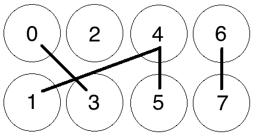

Grin's Proof-of-Work
====================

This document is meant to outline, at a level suitable for someone without prior knowledge, 
the algorithms and processes currently involved in Grin's Proof-of-Work system. We'll start
with a general overview of cycles in a graph and the Cuckoo Cycle algorithm which forms the 
basis of Grin's proof-of-work. We'll then move on to Grin-specific details, which will outline
the other systems that combine with Cuckoo Cycle to form the entirety of mining in Grin.

Please note that Grin is currently under active development, and any and all of this is subject to
(and will) change before a general release.

# Graphs and Cuckoo Cycle

Grin's basic Proof-of-Work algorithm is called Cuckoo Cycle, which is specifically designed
to be resistant to Bitcoin style hardware arms-races. It is primarily a memory bound algorithm,
which, (at least in theory,) means that solution time is bound by memory bandwidth
rather than raw processor or GPU speed. As such, mining Cuckoo Cycle solutions should be viable on
most commodity hardware, and require far less energy than most other GPU, CPU or ASIC-bound 
proof of work algorithms.

The Cuckoo Cycle POW is the work of John Tromp, and the most up-to-date documentation and implementations
can be found in [his github repository](https://github.com/tromp/cuckoo). The
[white paper](https://github.com/tromp/cuckoo/blob/master/doc/cuckoo.pdf) is the best source of
further technical details. 

There is also a [podcast with Mike from Monero Monitor](https://moneromonitor.com/episodes/2017-09-26-Episode-014.html)
in which John Tromp talks at length about Cuckoo Cycle; recommended listening for anyone wanting
more background on Cuckoo Cycle, including more technical detail, the history of the algorihm's development
and some of the motivations behind it.

## Cycles in a Graph

Cuckoo Cycle is an algorithm meant to detect cycles in a bipartite graph of N nodes 
and M edges. In plainer terms, a bipartite graph is one in which edges (i.e. lines connecting nodes)
travel only between 2 separate groups of nodes. In the case of the Cuckoo hashtable in Cuckoo Cycle, 
one side of the graph is an array numbered with odd indices (up to the size of the graph), and the other is numbered with even
indices. A node is simply a numbered 'space' on either side of the Cuckoo Table, and an Edge is a 
line connecting two nodes on opposite sides. The simple graph below denotes just such a graph, 
with 4 nodes on the 'even' side (top), 4 nodes on the odd side (bottom) and zero Edges 
(i.e. no lines connecting any nodes.) 

*A graph of 8 Nodes with Zero Edges*

Let's throw a few Edges into the graph now, randomly:

*8 Nodes with 4 Edges, no solution*

We now have a randomly-generated graph with 8 nodes (N) and 4 edges (M), or an NxM graph where 
N=8 and M=4. Our basic Proof-of-Work is now concerned with finding 'cycles' of a certain length 
within this random graph, or, put simply, a series of connected nodes starting and ending on the 
same node. So, if we were looking for a cycle of length 4 (a path connecting 4 nodes, starting
and ending on the same node), one cannot be detected in this graph.

Adjusting the number of Edges M relative to the number of Nodes N changes the difficulty of the 
cycle-finding problem, and the probability that a cycle exists in the current graph. For instance,
if our POW problem were concerned with finding a cycle of length 4 in the graph, the current difficulty of 4/8 (M/N)
would mean that all 4 edges would need to be randomly generated in a perfect cycle (from 0-5-4-1-0)
in order for there to be a solution. 

Let's add a few more edges, again at random:

*Cycle Found from 0-5-4-1-0*

If you increase the number of edges relative to the number 
of nodes, you increase the probability that a solution exists. With a few more edges added to the graph above,
a cycle of length 4 has appeared from 0-5-4-1-0, and the graph has a solution.

Thus, modifying the ratio M/N changes the number of expected occurrences of a cycle for a graph with 
randomly generated edges. 

For a small graph such as the one above, determining whether a cycle of a certain length exists 
is trivial. But as the graphs get larger, detecting such cycles becomes more difficult. For instance,
does this graph have a cycle of length 8, i.e. 8 connected nodes starting and ending on the same node?

*Meat-space Cycle Detection exercise*

The answer is left as an exercise to the reader, but the overall takeaways are: 

* Detecting cycles in a graph becomes more difficult exercise as the size of a graph grows. 
* The probability of a cycle of a given length in a graph increases as M/N becomes larger,
i.e. you add more edges relative to the number of nodes in a graph. 

## Cuckoo Cycle

The Cuckoo Cycle algorithm is a specialised algorithm designed to solve exactly this problem, and it does
so by inserting values into a structure called a 'Cuckoo Hashtable' according to a hash which maps nodes
into possible locations in two separate arrays. This document won't go into detail on the base algorithm, as
it's outlined plainly enough in section 5 of the 
[white paper](https://github.com/tromp/cuckoo/blob/master/doc/cuckoo.pdf). There are also several
variants on the algorithm that make various speed/memory tradeoffs, again beyond the scope of this document. 
However, there are a few details following from the above that we need to keep in mind before going on to more 
technical aspects of Grin's proof-of-work.
 
* The 'random' edges in the graph demonstrated above are not actually random but are generated by 
putting edge indices (0..N) through a seeded hash function, SIPHASH. Each edge index is put through the 
SIPHASH function twice to create two edge endpoints, with the first input value being 2 * edge_index, 
and the second 2 * edge_index+1. The seed for this function is based on a hash of a block header, 
outlined further below.
* The 'Proof' created by this algorithm is a set of nonces that generate a cycle of length 42, 
which can be trivially validated by other peers.
* Two main parameters, as explained above, are passed into the Cuckoo Cycle algorithm that affect the probability of a solution, and the
time it takes to search the graph for a solution: 
    * The M/N ratio outlined above, which controls the number of edges relative to the size of the graph.
    Cuckoo Cycle fixes M at N/2, which limits the number of cycles to a few at most.
    * The size of the graph itself
 

How these parameters interact in practice is looked at in more [detail below](#mining-loop-difficulty-control-and-timing).

Now, (hopefully) armed with a basic understanding of what the Cuckoo Cycle algorithm is intended to do, as well as the parameters that affect how difficult it is to find a solution, we move on to the other portions of Grin's POW system.

# Mining in Grin

The Cuckoo Cycle outlined above forms the basis of Grin's mining process, however Grin uses Cuckoo Cycle in tandem with several other systems to create a Proof-of-Work.

### Additional Difficulty Control

In order to provide additional difficulty control in a manner that meets the needs of a network with constantly evolving hashpower
availability, a further Hashcash-based difficulty check is applied to potential solution sets as follows: 

If the Blake2b hash
of a potential set of solution nonces (currently an array of 42 u32s representing the cycle nonces,) 
is less than an evolving difficulty target T, then the solution is considered valid. More precisely, 
the proof difficulty is calculated as the maximum target hash (2^256) divided by the current hash, 
rounded to give an integer. If this integer is larger than the evolving network difficulty, the POW
is considered valid and the block is submit to the chain for validation.

In other words, a potential proof, as well as containting a valid Cuckoo Cycle, also needs to hash to a value higher than the target difficulty. This difficulty is derived from:

### Evolving Network Difficulty

The difficulty target is intended to evolve according to the available network hashpower, with the goal of
keeping the average block solution time within range of a target (currently 60 seconds, though this is subject
to change). 

The difficulty calculation is based on both Digishield and GravityWave family of difficulty computation, 
coming to something very close to ZCash. The refence difficulty is an average of the difficulty over a window of
23 blocks (the current consensus value). The corresponding timespan is calculated by using the difference between 
the median timestamps at the beginning and the end of the window. If the timespan is higher or lower than a certain
range, (adjusted with a dampening factor to allow for normal variation,) then the difficulty is raised or lowered
to a value aiming for the target block solve time.

The minimum difficuly is 10, as defined in the consensus MINIMUM_DIFFICULTY value.

### The Mining Loop

All of these systems are put together in the mining loop, which attempts to create 
valid Proofs-of-Work to create the latest block in the chain. The following is an outline of what the main mining loop does during a single iteration:

* Get the latest chain state and build a block on top of it, which includes
    * A Block Header with new values particular to this mining attempt, which are:
    
        * The latest target difficulty as selected by the [evolving network difficulty](#evolving-network-difficulty) algorithm
        * A set of transactions available for validation selected from the transaction pool
        * A coinbase transaction (which we're hoping to give to ourselves)
        * The current timestamp
        * A randomly generated nonce to add further randomness to the header's hash
        * The merkle root of the UTXO set and fees (not yet implemented)

        * Then, a sub-loop runs for a set amount of time, currently configured at 2 seconds, where the following happens:

            * The new block header is hashed to create a hash value
            * The cuckoo graph generator is initialised, which accepts as parameters:
                * The hash of the potential block header, which is to be used as the key to a SIPHASH function
                that will generate pairs of locations for each element in a set of nonces 0..N in the graph. 
                * The size of the graph (a consensus value).
                * An easiness value, (a consensus value) representing the M/N ratio described above denoting the probability
                of a solution appearing in the graph
            * The Cuckoo Cycle detection algorithm tries to find a solution (i.e. a cycle of length 42) within the generated
            graph. 
            * If a cycle is found, a Blake2b hash of the proof is created and is compared to the current target
            difficulty, as outlined in [Additional Difficulty Control](#additional-difficulty-control) above.
            * If the Blake2b Hash difficulty is greater than or equal to the target difficulty, the block is sent to the
            transaction pool, propogated amongst peers for validation, and work begins on the next block.
            * If the Blake2b Hash difficulty is less than the target difficulty, the proof is thrown out and the timed loop continues.
            * If no solution is found, increment the nonce in the header by 1, and update the header's timestamp so the next iteration
            hashes a different value for seeding the next loop's graph generation step.
            * If the loop times out with no solution found, start over again from the top, collecting new transactions and creating
            a new block altogether.

### Mining Loop Difficulty Control and Timing

Controlling the overall difficulty of the mining loop requires finding a balance between the three values outlined above:

* Graph size (currently represented as a bit-shift value n representing a size of 2^n nodes, consensus value
  DEFAULT_SIZESHIFT). Smaller graphs can be exhaustively searched more quickly, but will also have fewer 
  solutions for a given easiness value. A very small graph needs a higher easiness value to have the same 
  chance to have a solution as a larger graph with a lower easiness value.
* The 'Easiness' consensus value, or the M/N ratio of the graph expressed as a percentage. The higher this value, the more likely
  it is a generated graph will contain a solution. In tandem with the above, the larger the graph, the more solutions 
  it will contain for a given easiness value. The Cuckoo Cycle implementations fix this M to N/2, giving
  a ratio of 50%
* The evolving network difficulty hash.  

These values need to be carefully tweaked in order for the mining algorithm to find the right balance between the 
cuckoo graph size and the evolving difficulty. The POW needs to remain mostly Cuckoo Cycle based, but still allow for
reasonably short block times that allow new transactions to be quickly processed.

If the graph size is too low and the easiness too high, for instance, then many cuckoo cycle solutions can easily be 
found for a given block, and the POW will start to favour those who can hash faster, precisely what Cuckoo Cycle is 
trying to avoid. If the graph is too large and easiness too low, however, then it can potentially take any solver a 
long time to find a solution in a single graph, well outside a window in which you'd like to stop to collect new
transactions.

These values are currently set to 2^12 for the graph size and 50% (as fixed by Cuckoo Cycle) for the easiness value, 
however the size is only a temporary values for testing. The current miner implementation is very unoptimised, 
and the graph size will need to be changed as faster and more optimised Cuckoo Cycle algorithms are put in place.

### Pooling Capability

Contrary to some existing concerns about Cuckoo Cycle's poolability, the POW implementation in Grin as described above
is perfectly suited to a mining pool. While it may be difficult to prove efforts to solve a single graph in isolation,
the combination of factors within Grin's proof-of-work combine to enforce a notion called 'progress-freeness', which
enables 'poolability' as well as a level of fairness among all miners. 

#### Progress Freeness

Progress-freeness is central to the 'poolability' of a proof-of-work, and is simply based on the idea that a solution 
to a POW problem can be found within a reasonable amount of time. For instance, if a blockchain
has a one minute POW time and miners have to spend one minute on average to find a solution, this still satisfies the POW
requirement but gives a strong advantage to big miners. In such a setup, small miners will generally lose at least one minute
every time while larger miners can move on as soon as they find a solution. So in order to keep mining relatively progress-free,
a POW that requires multiple solution attempts with each attempt taking a relatively small amount of time is desirable.

Following from the this, Grin's progress-freeness is due to the fact that a solution to a Cuckoo with Grin's default parameters
can typically be found in under a second on most GPUs, and there is the additional requirement of the Blake2b difficulty check
on top of that. Members of a pool are thus able to prove they're working on a solution to a block by submitting valid Cuckoo solutions
(or a small bundle of them) that simply fall under the current network target difficulty.

