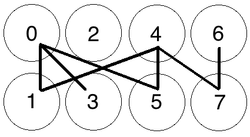
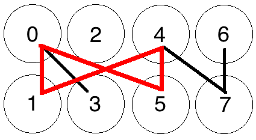

# Grin의 작업증명

이 문서는 사전지식이 없는 사람의 수준에서 Grin의 작업증명 시스템과 관련된 알고리즘 및 프로세스를 대략적으로 설명합니다. Grin의 작업 증명의 기초를 형성하는 Cuckoo Cycle 알고리즘과 그래프의 사이클에 대한 개요로 시작하겠습니다. 그런 다음 Cuckoo Cycle과 결합하여 Grin에서 마이닝 전체 형태를 형성하는 시스템인 Grin특유의 세부 정보에 대해서  설명합니다.

Grin은 현재 활발하게 개발 중이며,이 중 일부 및 전부는 릴리즈 전에 변경 될 수 있습니다.

## Graphs 와 Cuckoo Cycle

Grin의 기본 Proof-of-Work 알고리즘은 Cuckoo Cycle 이라고 합니다 이 알고리즘은 Bitcoin 스타일의 하드웨어 경쟁에 (ASIC을 뜻함 - 역자 주) 내성을 갖도록 특별히 설계되었습니다 . Cuckoo cycle은 이론 상으로 slution time 이 CPU 프로세서 또는 GPU 속도가 아닌 메모리 대역폭에 의해 제한된다는 메모리 바운드( [memory bound function](https://en.wikipedia.org/wiki/Memory_bound_function)) 알고리즘 입니다. 따라서 마이닝 Cuckoo cycle solution은 대부분의 상용 하드웨어에서 실행 가능해야만 하고 다른 대부분의 GPU, CPU 또는 ASIC 바인딩 된 작업 증명 알고리즘보다 훨씬 적은 에너지를 필요로 합니다.

Cuckoo cyle pow의 최신 문서들과 구현은 John Tromp 의 [깃헙](https://github.com/tromp/cuckoo)에서 볼 수 있으며 이 알고리즘의 pow는 그의 작업 결과물입니다. 이 [링크](https://github.com/tromp/cuckoo/blob/master/doc/cuckoo.pdf)는 Cuckoo cycle 의 백서이고 좀 더 기술적인 디테일에 대해서 최고의 자료입니다. 

John Tromp가 Cuckoo Cycle 에 대해 한참을 이야기하는 [Monero Monitor의 마이크가 진하는 팟 캐스트 (Podcast)](https://moneromonitor.com/episodes/2017-09-26-Episode-014.html)도 있습니다. Cuckoo cycle 에 대한 기술적인 세부사항 이라던지 알고리즘 개발의 역사 또는 그 안에 숨겨진 개발 동기등 관련 배경 지식을 더 많이 원하는 사람들을 위해 청취해보기를 추천합니다.

### Graph 의 Cycle

Cuckoo Cycle은 N 개의 노드와 M 개의 가장자리로 구성된 양분 그래프의 사이클을 감지하기 위한 알고리즘입니다. 간단히 말해서, 양분 그래프는 엣지(즉, 노드를 연결하는 선)가 2개의 노드 그룹 사이에서만 이동하는 그래프입니다. Cuckoo Cycle에서 Cuckoo 해시 테이블의 경우, 그래프의 한면은 인덱스(그래프 크기까지)가 홀수개 인 배열이고 다른 배열은 짝수 인덱스로 번호가 매겨집니다. 노드는 단순히 Cuckoo Table의 한쪽에 번호가 매겨진 '공간'이고, Edge는 반대쪽에있는 두 노드를 연결하는 선입니다. 아래의 간단한 그래프는 '짝수'측면 (상단)에 4 개의 노드, 홀수 측면 (하단)에 4 개의 노드 및 엣지 (즉, 모든 노드를 연결하는 선)가 없는 그래프를 나타냅니다.

*제로 엣지가 있는 8개 노드의 그래프*

랜덤하게 몇개의 엣지들을 그래프에 던져 보겠습니다.

*솔루션이 없는 8개의 노드와 4개의 엣지*

이제 8개의 노드 (N)와 4개의 에지 (M) 또는 N = 8과 M = 4 인 NxM 그래프가 있는 랜덤하게 생성된 그래프가 있습니다. 기본적인 Proof-of-Work는 이 랜덤한 그래프 내에서 특정 길이의 '주기'를 찾거나 단순히 같은 노드에서 시작하고 끝나는 일련의 연결된 노드를 찾는 것과 관련이 있습니다. 따라서 길이 4 (동일한 노드에서 시작하고 끝나는 4 개의 노드를 연결하는 경로)의 사이클을 찾는다면 이 그래프에서 하나도 찾을 수 없습니다.

노드 수 N과 연관된 엣지의 수인 M를 조정하면 사이클 찾기 문제의 난이도와 현재 그래프에서 사이클이 존재할 확률이 바뀝니다. 예를 들어, POW 문제가 그래프에서 길이 4의 주기를 찾는 것과 관련된다면, 현재의 4/8 난이도 (M / N)는 모든 4 개의 엣지가 0-5-4-1-0 인 완벽한 사이클에서 무작위로 생성 된 것을 의미하고 그것이 정답임을 의미합니다.

랜덤으로 몇개의 엣지를 다시 더해보겠습니다.

*7개의 엣지가 있는 8개의 노드*

사이클은 아래와 같이 찾을 수 있습니다.

*0-5-4-1-0 에서 발견 할 수 있는 사이클*

노드 수에 비례하여 엣지의 수를 늘리면 솔루션이 있을 확률이 높아집니다. 위의 그래프에 몇 개의 가장자리가 추가되면 0-5-4-1-0에서 길이 4의 사이클이 나타나고 그래프에는 솔루션이 있습니다.

따라서, 비율 M / N을 변경하면 무작위로 생성된 엣지를 갖는 그래프에 대한 사이클의 예상 발생 횟수가 변경됩니다.

위와 같은 작은 그래프의 경우 특정 길이의 주기가 존재하는지 여부를 판별하는 것은 간단합니다. 그러나 그래프가 커질수록 이러한 주기를 감지하는 것이 더욱 어려워집니다. 예를 들어 이 그래프는 길이가 8 인 사이클, 즉 동일한 노드에서 시작하고 끝나는 8 개의 연결된 노드라고 할 수 있습니까?

*실제 사이클을 확인해봅시다*

대답은 독자에게 연습으로 남겨 두지만 전반적인 원리는 다음과 같습니다.

* 그래프의 크기에 비례해서 그래프에서 사이클을 감지하는 것이 더 어려워집니다.

* M/N이 커짐에 따라 그래프에서 주어진 길이의 주기 확률이 증가합니다. 즉, 그래프의 노드 수에 따라서 엣지를 더 추가합니다.

### Cuckoo Cycle

Cuckoo Cycle 알고리즘은 정확히 이 문제를 해결하기 위해 고안된 특수 알고리즘입니다. Cuckoo Cylcle 알고리즘은 노드를 두 개의 개별 배열로 가능한 위치에 매핑하는 해시에 따라 'Cuckoo Hashtable' 라고 불리는 구조에 값을 삽입하여 수행합니다. 이 문서는 기본 알고리즘에 대해서는 자세히 설명하지 않으며 [백서](https://github.com/tromp/cuckoo/blob/master/doc/cuckoo.pdf)에서 충분히 설명되어 있습니다. 또한 알고리즘에서 속도/메모리 트레이드 오프를 만드는 몇몇 변형이 있지만 이 문서의 (설명)범위를 역시 넘어갑니다.
하지만 Grin의 작업증명의 기술적 측면을 계속 설명하기 전에 앞서 알아둬야 할 몇 가지 세부 사항이 있습니다.

* 위의 그래프에서 '랜덤'에지는 실제로 랜덤하지 않지만 시드배정을 받은 해시함수 인 SIPHASH에 엣지 인덱스(0..N)를 넣어서 생성됩니다. 각 엣지 인덱스는 SIPHASH 함수를 두 번 사용해서 두 개의 엣지 엔드포인를 만들어 냅니다. 첫 번째 엣지 엔드포인트는 2* edge_index이고, 두 번째 엣지 엔드포인트는 2* edge_index+1 입니다. 이 함수의 시드는 블록 헤더의 해시를 기반으로 하고 관 아래에서 자세히 설명합니다.

* 이 알고리즘에 의해 만들어진 '증명'는 길이가 42 인 사이클을 생성하는 nonce 집합이고 다른 피어들이 쉽게 검증 할 수 있습니다.

* 위에서 설명한 두 가지 주요 매개 변수는 솔루션의 확률에 영향을 주는 Cuckoo Cycle 알고리즘과 솔루션 검색을 위해 그래프를 검색하는 데 걸리는 시간의 일부가 됩니다.
  * 위에서 설명한 M/N 비율은 그래프의 크기에 따른 엣지의 숫자를 제어합니다.
    Cuckoo Cycle이 M을 N의 절반 값으로 고정시킨다면 사이클의 숫자를 최대한 몇몇개로 제한합니다.
  * 그래프의 사이즈.

이 파라메터들이 실제로 어떻게 상호작용 하는지는 [이 문서](#mining-loop-difficulty-control-and-timing)를 참고하세요.

Cuckoo Cycle 알고리즘이 무엇을 하려는지, 파라매터가 솔루션을 찾는데 것이 얼마나 영향을 미치는 지에 대해 기본적으로 이해하고 있으므로, Grin의 POW 시스템의 다른 부분으로 넘어갑니다.

## Mining in Grin

위에서 설명한 Cuckoo Cycle은 Grin의 마이닝 프로세스의 윤곽을 설명합니다. 그러나 Grin은 Cuckoo Cycle을 여러 다른 시스템과 함께 사용하여 Proof-of-Work를 만듭니다.

### 추가적인 난이도 조정에 대해서

계속 늘어나는 해시파워의 가용성를 가진 네트워크의 필요성 때문에 추가적인 난이도에 대한 제어권을 제공하기 위해 Hashcash 기반 난이도 확인은 다음과 같이 잠재적인 솔루션 세트에 적용됩니다.

솔루션 논스의 잠재적인 집합인 Blake2b 해시가 (현재는 42 u32의 배열이 사이클 논스를 나타냅니다.) 계속 늘어나는 난이도인 타겟 T보다 작다면, 그 솔루션은 유효하다고 간주됩니다.
좀더 정확하게는, 증명 난이도는 현재 해시로 나눈 최대 목표 해시 (2 ^ 256)로 계산되고 정수(integer)로 얻기 위해 반올림됩니다.
이 정수가 증가하는 네트워크 난이도보다 큰 경우, POW는 유효한 것으로 간주되며 블록이 유효성 검사를 위해 체인에 제출됩니다.

즉, 잠재적 증거는 유효한 Cuckoo 사이클을 포함 할뿐만 아니라 또한 목표 난이도보다 높은 값으로 해시해야합니다. 이 난이도는 다음과 같이 유도됩니다.

### 증가하는 네트워크 난이도

난이도는 평균 블록 생성 시간을 특정 범위 내로 유지하기 위한(현재는 60 초이지만 변경 될 수 있음)목표로 사용 가능한 네트워크 해시파워에 따라 증가시킬 예정입니다.

난이도 계산은 Digishield 및 GravityWave 계열의 난이도 계산을 기반으로 ZCash와 매우 비슷합니다. 참조 난이도는 현재 합의 값인 23 개 블록 난이도의 평균입니다.
해당 시간 간격은 23개 블록의 시작과 끝의 중간 타임 스탬프 간의 차이를 사용하여 계산됩니다. 시간 범위가 특정 범위보다 높거나 낮으면 (표준 편차를 허용하는 dampening 팩터로 조정) 블록 생성시간을 목표로 하는 값으로 난이도를 높이거나 낮 춥니 다.

### 마이닝 루프(Loop)

이러한 시스템은 유요한 작업증명이 체인에 최신 증명을 생성하려 하는  마이닝 루프에 모두 통합됩니다.
다음은 메인 마이닝 루프가 단일 반복 중에 수행하는 작업에 대한 개요를 설명합니다.

* 최신 체인 상태를 얻고 그 위해 블록을 만드는 것은 다음을 포함합니다.
  * 새값을 가진 블록헤더는 :
    * [이전 섹션](#증가하는-네트워크-난이도) 에서 설명했던 알고리즘으로 선택된 최신 타겟 난이도
    * 트랜잭션 풀에서 입증된 트랜잭션의 세트
    * 코인베이스 트랜잭션
    * 현재 타임 스탬프
    * 헤더의 해시에 랜덤하게 생성된 논스를 더해서 추가적으로 랜덤성을 추가
    * (아직 구현되지 않은) UTXO세트와 fee의 머클루트
      * 그런 다음 Sub-loop는 현재 2초로 설정된 시간동안 작동하며 다음과 같은 상황이 일어납니다.
        * 새로운 블록 헤더를 해시해서 새로운 해시 값을 만듭니다.
        * 다음과 같은 값을 파라메터로 받아들인 Cuckoo 그래프 제너레이터가 초기화 됩니다.
          * 그래프에서 0..n 인 논스세트의 각 요소 위치 쌍을 만들어내는 SIPHASH 함수의 키로 사용 되는 잠재적인 블록 헤더의 해시
          * 그래프의 사이즈 ( 합의 값)
          * 합의 값인 Easiness 값은 M/N비율을 나타내며 이 값은 위에서 나타낸것 처럼 그래프에 나타나는 솔루션의 확률입니다.
        * Cuckoo 사이클 탐지 알고리즘은 생성된 그래프 내에서 솔루션을 찾으려고 합니다.
        * 만약 사이클을 찾았다면 증거 Blake2b 해시가 생성되고 현재 타겟의 난이도와 비교됩니다. 이와 관련해서는 위에 [추가적인 난이도 조정에 대해서](#추가적인-난이도-조정에-대해서)에 설명되어 있습니다.
        * 만약 Blake2b 해시의 난이도가 타겟난이도보다 크거나 같다면 블록은 트랜잭션 풀에 보내지고 유효성을 검사하기 위해 피어들에게 전파됩니다. 그리고 다음 블록을 마이닝을 시작합니다.
        * 만약 Blake2b 해시의 난이도가 타겟의 난이도 보다 낮다면, 증명된 것 (Blake2b 해시)는 버리고 다시 Sub-loop인 타임 루프가 계속됩니다.
        * 만약 솔루션을 찾지 못했다면 헤더에 있는 논스값을 1 증가시킵니다. 그리고 헤더의 타임스탬프를 업데이트 합니다. 그래서 다음 루프의 그래프 생성 과정의 기초가 되는 이터레이션 해시가 다른 값이 됩니다.
        * 솔루션을 찾지 못한채 루프의 타임아웃이 되었다면 제일 위해서부터 다시 시작하고 새로운 트랜잭션을 모으고 새로운 블록을 다 같이 만듭니다.

### 마이닝 루프 난이도 조정과 타이밍

마이닝 루프의 난이도를 조정하기 위해서는 위해서 언급한 세 값의 밸런스를 찾아야 합니다.

* 그래프 크기 (현재 2 ^ n 노드의 크기를 나타내는 비트 시프트 값 n으로 표현, 합의 값은 DEFAULT_SIZESHIFT임).
  더 작은 그래프는 철저히 더 빨리 검색 될 수 있지만 주어진 Easiness value 에 대해 더 적은 솔루션를 가집니다. 아주 작은 그래프는 더 낮은 Easiness value을 가진 더 큰 그래프와 (비교를 할때) 해답을 찾는 동일한 기회를 가지기 위해 더 높은 Easiness value가 필요합니다.
* 'Easiness'합의 값,또는 퍼센티지로 나타나는 그래프의 M / N 비율.
  이 값이 높을수록 생성 된 그래프에 솔루션이 포함될 확률이 높아집니다. 위와 함께 그래프가 커질수록 주어진 Easiness value 에 대해 더 많은 솔루션이 포함될 가능성이 높아집니다. Cuckoo Cycle 구현은 이 M을 N / 2로 고정시켜 비율을 50%로 만듭니다.
* 증가한 네트워크 난이도 해시값.

마이닝 알고리즘이 Cuckoo 그래프 크기와 증가하는 난이도 사이에서 올바른 균형을 찾을 수 있도록 위의 값들은 신중하게 조정해야 합니다. POW는 대부분 Cuckoo Cycle 기반을 유지할 필요가 있지만 새로운 트랜잭션을 빨리 처리 할 수 ​​있도록 합리적인 수준에서 블록 생성시간을 짧게 해야 합니다.

예를 들어, 그래프 크기가 ​​너무 작고 easiness (value)가 높다면 주어진 블록에 대해 많은 Cuckoo 사이클 솔루션을 쉽게 찾을 수 있으며 POW는 Cuckoo Cycle이 피하고자 하는 현상 즉, 더 빨리 해싱 할 수 있는 사람들이 선호할 것입니다.
그러나 만약에 그래프가 너무 크고 easiness (vaule)가 너무 낮으면 단일 그래프에서 솔루션을 찾는 데 시간이 오래 걸릴 수 있고 새로운 트랜잭션을 수집하는것을 중단 할 수도 있습니다.

현재 이 값은 그래프 사이즈로 2^12으로 세팅되어 있고 Cuckoo Cycle로 고정된 easiness value는 50% 로 설정되어 있지만 (이러한) 사이즈 값은 테스트를 위한 임시 설정 값입니다. 현재의 마이너 구현체는 최적화되지 않았으며, 그래프 사이즈는 보다 빠르고 최적화 된 Cuckoo Cycle 알고리즘으로 변경 될 필요가 있습니다.

### Pooling Capability

Cuckoo Cycle의 poolability에 대한 현재의 우려와는 달리 위에서 설명한 Grin의 POW 구현은 마이닝 풀에 아주 적합합니다.
별개의 단일 그래프를 풀기 위한 노력을 증명하는 것은 어려운 반면에, Grin의 작업증명 내에서 조합 된 요소들이 결합하여 모든 마이너들의 공정성뿐만 아니라 'poolability'을 가능하게 만드는 'progress-freeness' 라는 개념을 강제합니다.

#### Progress Freeness

Progress-freeness 는 직업 증명의 'poolability'의 핵심이며 POW 문제에 대한 해결책이 합리적인 시간 내에 발견 될 수 있다는 단순한 생각에 기반합니다.
예를 들어, 블록체인에서 1분의 POW시간이 있고 (당연히) 마이너가 솔루션을 찾기 위해 평균 1 분을 써야합니다. 이는 POW의 요건을 충족하지만 규모가 큰 마이너에게 이점을 제공합니다.
이러한 환경에서 소규모 광부는 적어도 1분을 매번 잃어 버리는 반면 큰 광부는 해결책을 찾으면 (바로 다음루프로) 이동할 수 있습니다.
따라서 광업을 상대적으로 progress-free 시키기 위해서는 각 시도마다 상대적으로 적은 시간이 걸리며 다수의 솔루션을 찾는 시도가 있는 POW가 바람직합니다.

Grin의 Progress - freeness는 Grin의 기본 파라매터가있는 Cuckoo의 솔루션이 일반적으로 대부분의 GPU에서 1초 이내에 발견 될 수 있고 Blake2b 난이도 체크의 추가 요구사항이 그 위에 있다는 사실에 기인합니다 .
따라서 Pool의 멤버는 현재의 네트워크 타겟 난이도에 속하는 유효한 Cuckoo 솔루션 (또는 Cuckoo 솔루션의 작은 묶음)을 제출하여 블록의 솔루션에 대해서 작업하고 있음을 증명할 수 있습니다.
