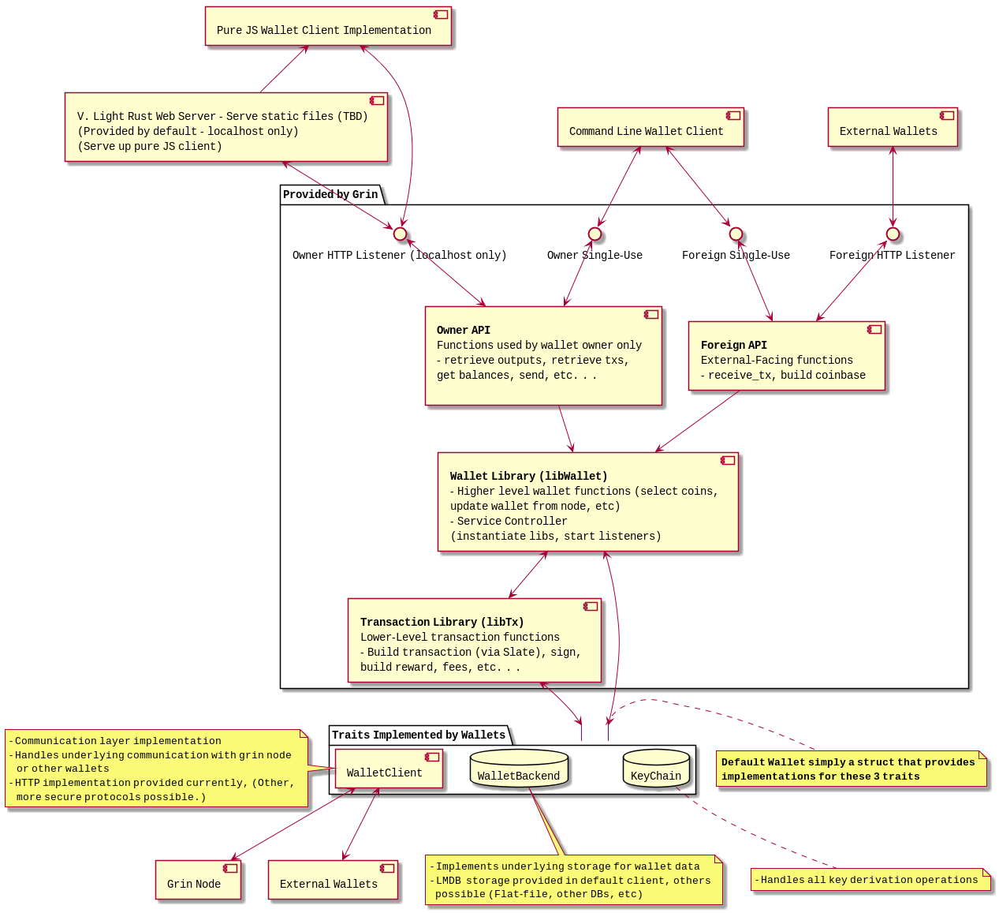

# Grin Wallet + Library Design



## High Level Wallet Design Overview

The current Grin `wallet` crate provides several layers of libraries, services, and traits that can be mixed, matched and reimplemented to support
various needs within the default Grin wallet as well as provide a set of useful library functions for 3rd-party implementors. At a very high level,
the code is organized into the following components (from highest-level to lowest):

* **Command Line Client** - The command line client invoked by `grin wallet [command]`, simply instantiates the other components below
    and parses command line arguments as needed.
* **Web Wallet Client** - [Work In Progress]  A web wallet client accessible from the local machine only. Current code can be viewed here:
  https://github.com/mimblewimble/grin-web-wallet
* **Static File Server** - [TBD] A means of serving up the web wallet client above to the user (still under consideration)
* **libWallet** - A high level wallet library that provides functions for the default grin wallet. The functions in here can be somewhat
  specific to how the grin wallet does things, but could still be reused by 3rd party implementors following the same basic principles as grin
  does. Major functionality is split into:
  * **Owner API** - An API that provides information that should only be viewable by the wallet owner
  * **Foreign API** - An API to communicate with other wallets and external grin nodes
  * **Service Controller** - A Controller that instantiates the above APIs (either locally or via web services)
  * **Internal Functions** Helper functions to perform needed wallet tasks, such as selecting coins, updating wallet outputs with
  results from a Grin node, etc.
* **libTx** - Library that provides lower-level transaction building, rangeproof and signing functions, highly-reusable by wallet implementors.
* **Wallet Traits** - A set of generic traits defined within libWallet and the `keychain` crate . A wallet implementation such as Grin's current
  default only needs to implement these traits in order to provide a wallet:
  * **NodeClient** - Defines communication between the wallet, a running grin node and/or other wallets
  * **WalletBackend** - Defines the storage implementation of the wallet
  * **KeyChain** - Defines key derivation operations
  
## Module-Specific Notes

A full API-Description for each of these parts is still TBD (and should be generated by rustdoc rather than repeated here). However a few design
notes on each module are worth mentioning here.

### Web Wallet Client / Static File Server

This component is not a 3rd-party hosted 'Web Wallet' , but a client meant to be run on the local machine only by the wallet owner. It should provide
a usable browser interface into the wallet, that should be functionally equivalent to using the command line but (hopefully) far easier to use.
It is currently not being included by a default grin build, although the required listener is currently being run by default. To build and test this
component, see instructions on the [project page](https://github.com/mimblewimble/grin-web-wallet). The 'Static File Server' is still under
discussion, and concerns how to provide the web-wallet to the user in a default Grin build.

### Owner API / Foreign API

The high-level wallet API has been split into two, to allow for different requirements on each. For instance, the Foreign API would listen on
an external-facing port, and therefore potentially has different security requirements from the Owner API, which can simply be bound to localhost
only.

### libTX

Transactions are built using the concept of a 'Slate', which is a data structure that gets passed around to all participants in a transaction,
with each appending their Inputs, Outputs or Signatures to it to build a completed wallet transaction. Although the current mode of operation in
the default client only supports single-user - single recipient, an arbitrary number of participants to a transaction is supported within libTX.

### Wallet Traits

In the current code, a Wallet implementation is just a combination of these three traits. The vast majority of functions within libwallet
and libTX have a signature similar to the following:

```rust
pub fn retrieve_outputs<T: ?Sized, C, K>(
!·wallet: &mut T,
!·show_spent: bool,
!·tx_id: Option<u32>,
) -> Result<Vec<OutputData>, Error>
where
!·T: WalletBackend<C, K>,
!·C: NodeClient,
!·K: Keychain,
{  
```

With `T` in this instance being a class that implements  the `WalletBackend` trait, which is further parameterized with implementations of
`NodeClient` and `Keychain`.

There is currently only a single implementation of the Keychain trait within the Grin code, in the `keychain` crate exported as `ExtKeyChain`.
The `Keychain` trait makes several assumptions about the underlying implementation, particularly that it will adhere to a
[BIP-38 style](https://github.com/bitcoin/bips/blob/master/bip-0038.mediawiki) 'master key -> child key' model.

There are two implementations of `NodeClient` within the code, the main version being the `HTTPNodeClient` found within `wallet/src/client.rs` and
the seconds a test client that communicates with an in-process instance of a chain. The NodeClient isolates all network calls, so upgrading wallet
communication from the current simple http interaction to a more secure protocol (or allowing for many options) should be a simple
matter of dropping in different `NodeClient` implementations.

There are also two implementations of `WalletBackend` within the code at the base of the `wallet` crate. `LMDBBackend` found within
`wallet/src/lmdb_wallet.rs` is the main implementation, and is now used by all grin wallet commands. The earlier `FileWallet` still exists
within the code, however it is not invoked, and given there are no real advantages to running it over a DB implementation, development on it
has been dropped in favour of the LMDB implementation.